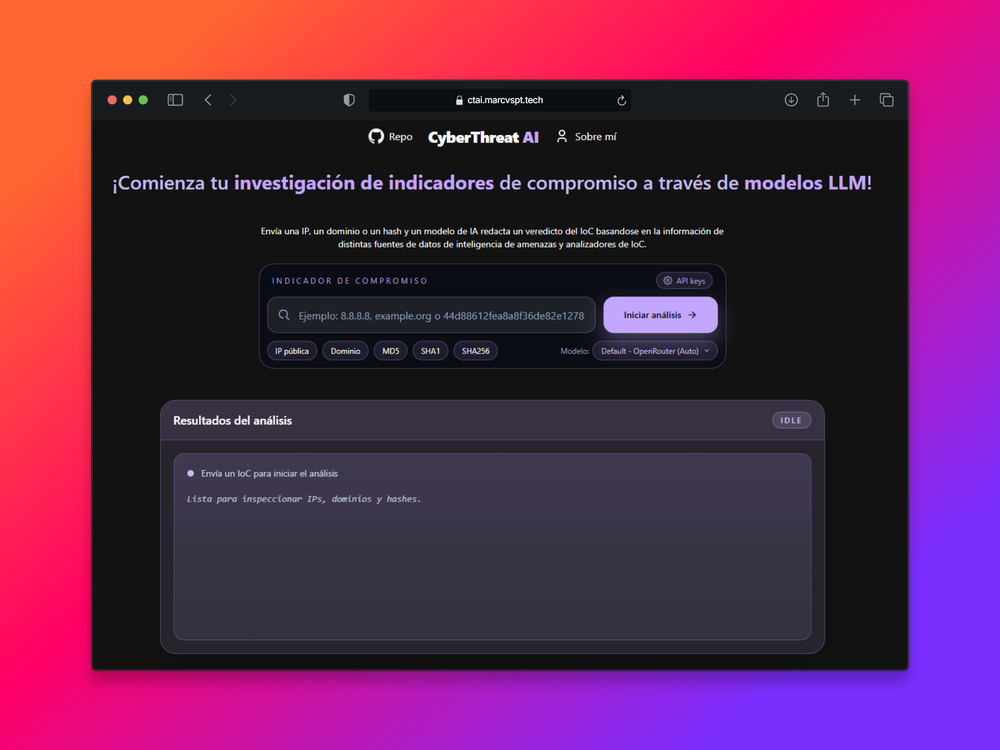

# Marcvspt

Perfil enfocado en ciberseguridad, automatizacion, infraestructura y desarrollo de herramientas practicas.

## Sobre mi

- Me interesa construir proyectos utiles para el campo de la ciberserguridad en relación a pentesting, threat intelligence, seguridad perimetral, seguridad de redes y operaciones de sistemas.
- Disfruto crear herramientas CLI, automatizaciones en shell y aplicaciones web tecnicas.
- Comparto aprendizajes, guias y proyectos en evolucion continua.

## Proyectos principales

### 1. CyberThreat AI

Plataforma para analizar IoCs (IP, dominio, hash) con fuentes CTI y soporte de IA.

- Repo: [marcvspt/cyberthreat-ai](https://github.com/marcvspt/cyberthreat-ai)
- Demo: [ctai.marcvspt.tech](https://ctai.marcvspt.tech)
- Stack: Astro, TypeScript, Tailwind, OpenRouter, VirusTotal, AbuseIPDB, PolySwarm, Robtex

### 2. marcvspt-web

Sitio personal y blog tecnico para contenido de ciberseguridad e infraestructura.

- Repo: [marcvspt/marcvspt-web](https://github.com/marcvspt/marcvspt-web)
- Web: [marcvspt.tech](https://www.marcvspt.tech)
- Stack: Astro, Tailwind, TypeScript

### 3. dotfiles

Configuracion personal de entorno Linux/WSL (shell, editor, herramientas y ajustes base).

- Repo: [marcvspt/dotfiles](https://github.com/marcvspt/dotfiles)
- Enfoque: productividad, personalizacion de terminal y setup reproducible

### 4. bash-tools

Coleccion de scripts Bash para tareas de red, monitoreo y mantenimiento.

- Repo: [marcvspt/bash-tools](https://github.com/marcvspt/bash-tools)
- Incluye: escaneo de red, escaneo de puertos, limpieza de Docker, monitoreo de procesos

### 5. gpg-pysuite

Suite CLI en Python para operaciones GPG sin importar llaves al keyring local.

- Repo: [marcvspt/gpg-pysuite](https://github.com/marcvspt/gpg-pysuite)
- Funciones: generar, cifrar, descifrar, firmar y verificar

### 6. revproxy-docker

Implementacion de reverse proxy con Nginx + Docker + SSL para multiples servicios web.

- Repo: [marcvspt/revproxy-docker](https://github.com/marcvspt/revproxy-docker)
- Enfoque: despliegue multi-servicio con certificados TLS automatizables

## Tecnologias frecuentes

### Desarrollo

`Linux` `Bash` `PowerShell` `Python` `TypeScript` `Astro` `Tailwind` `Docker` `Nginx`

### Ciberseguridad

`Firewall` `WAF` `SEG` `EPP` `EDR` `XDR` `SIEM`

## Áreas de especialidad

`CTI` `Pentesting` `Seguridad perimetral` `Seguridad de redes` `Seguridad de dispositivos finales` `CTI` `Respuesta ante incidentes`

## Contacto

- GitHub: [@marcvspt](https://github.com/marcvspt)
- X/Twiiter: [@marcvspt](https://x.com/marcvspt)
- Web: [marcvspt.tech](https://www.marcvspt.tech)

---

Si te interesan proyectos de ciberseguridad aplicada, redes e infraestructura, automatizacion y tooling, aqui encontras repositorios utiles.
