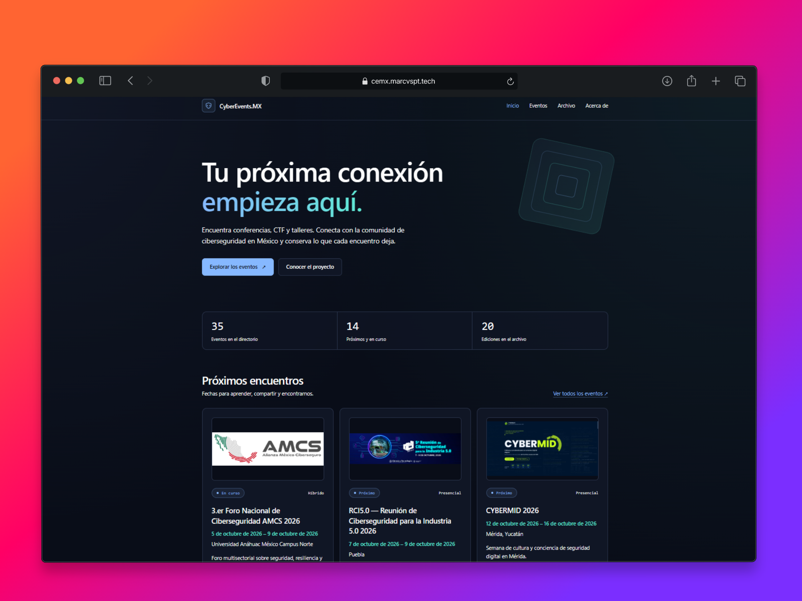
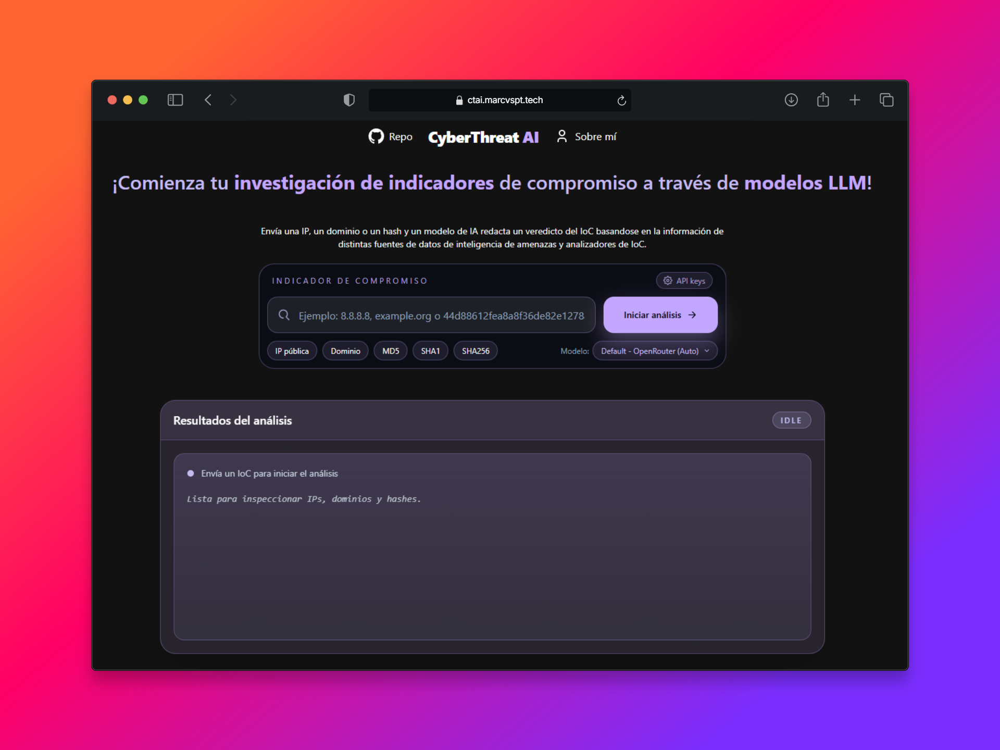
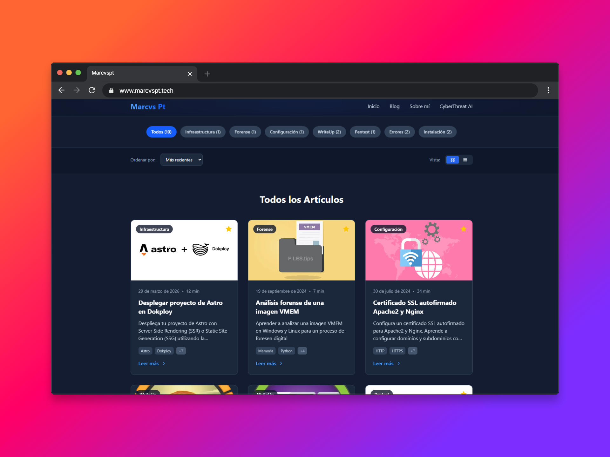
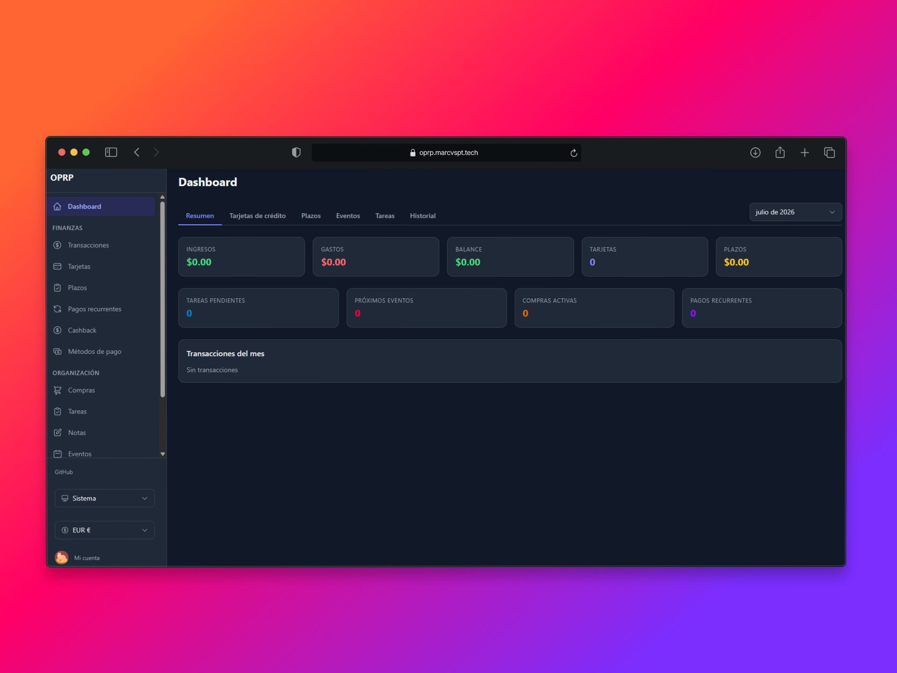

# Marcvspt

Perfil enfocado en ciberseguridad, automatizacion, infraestructura y desarrollo de herramientas practicas.

## Sobre mi

- Me interesa construir proyectos utiles para el campo de la ciberserguridad en relación a pentesting, threat intelligence, seguridad perimetral, seguridad de redes y operaciones de sistemas.
- Disfruto crear herramientas CLI, automatizaciones en shell y aplicaciones web tecnicas.
- Comparto aprendizajes, guias y proyectos en evolucion continua.

## Proyectos principales

### CyberEvents MX

Sitio que recopila y centraliza información de eventos actuales y pasados relacionados a la ciberseguridad en México

- Repo: [marcvspt/cyberevents-mx](https://github.com/marcvspt/cyberevents-mx)
- Web: [cemx.marcvspt.tech](https://cemx.marcvspt.tech)
- Stack: Astro, Tailwind, TypeScript

### 2. CyberThreat AI (CTAI)

Plataforma para analizar IoCs (IP, dominio, hash) con fuentes CTI y soporte de IA.

- Repo: [marcvspt/cyberthreat-ai](https://github.com/marcvspt/cyberthreat-ai)
- Demo: [ctai.marcvspt.tech](https://ctai.marcvspt.tech)
- Stack: Astro, TypeScript, React, Tailwind, OpenRouter, VirusTotal, AbuseIPDB, PolySwarm, Robtex

### 3. Web Marcvs Pt

Sitio personal y blog tecnico para contenido de ciberseguridad e infraestructura.

- Repo: [marcvspt/marcvspt-web](https://github.com/marcvspt/marcvspt-web)
- Web: [www.marcvspt.tech](https://www.marcvspt.tech)
- Stack: Astro, Tailwind, TypeScript

### 4. Open Personal Resource Planning (OPRP)

Aplicación  para gestión financiera y organización personal. Centraliza registro de transacciones, plazos, tarjetas de crédito, servicios, compras, despensa, notas, tareas, eventos, cashback y más en un solo lugar.

- Repo: [marcvspt/open-prp](https://github.com/marcvspt/open-prp)
- Web: [oprp.marcvspt.tech](https://oprp.marcvspt.tech)
- Stack: Astro, Tailwind, React, Clerk, TursoDB, TypeScript

### 5. dotfiles

Configuracion personal de entorno Linux/WSL (shell, editor, herramientas y ajustes base).

- Repo: [marcvspt/dotfiles](https://github.com/marcvspt/dotfiles)
- Enfoque: productividad, personalizacion de terminal y setup reproducible

### 6. Bash Tools

Coleccion de scripts Bash para tareas de red, monitoreo y mantenimiento.

- Repo: [marcvspt/bash-tools](https://github.com/marcvspt/bash-tools)
- Incluye: deteccion de hosts activos vía PING y latencia

### 7. Simple Network Monitor (SNM)

Daemon de monitoreo de conectividad por ping persistente, administrado completamente desde una sola CLI 

- Repo: [marcvspt/snm](https://github.com/marcvspt/snm)
- Incluye: escaneo de red, escaneo de puertos, limpieza de Docker, monitoreo de procesos

### 8. GPG-PySuite

Suite CLI en Python para operaciones GPG sin importar llaves al keyring local.

- Repo: [marcvspt/gpg-pysuite](https://github.com/marcvspt/gpg-pysuite)
- Funciones: generar, cifrar, descifrar, firmar y verificar

### 9. Reverse Proxy Docker

Implementacion de reverse proxy con Nginx + Docker + SSL para multiples servicios web.

- Repo: [marcvspt/revproxy-docker](https://github.com/marcvspt/revproxy-docker)
- Enfoque: despliegue multi-servicio con certificados TLS automatizables

## Tecnologias frecuentes

### Desarrollo

`Linux` `Bash` `PowerShell` `Python` `TypeScript` `Astro` `Tailwind` `Docker` `Nginx`

### Ciberseguridad

`Firewall` `WAF` `SEG` `EPP` `EDR` `XDR` `SIEM`

## Áreas de especialidad

`CTI` `Pentesting` `Seguridad perimetral` `Seguridad de redes` `Seguridad de dispositivos finales` `CTI` `Respuesta ante incidentes`

## Contacto

- GitHub: [@marcvspt](https://github.com/marcvspt)
- X/Twiiter: [@marcvspt](https://x.com/marcvspt)
- Web: [marcvspt.tech](https://www.marcvspt.tech)

---

Si te interesan proyectos de ciberseguridad aplicada, redes e infraestructura, automatizacion y tooling, aqui encontras repositorios utiles.
